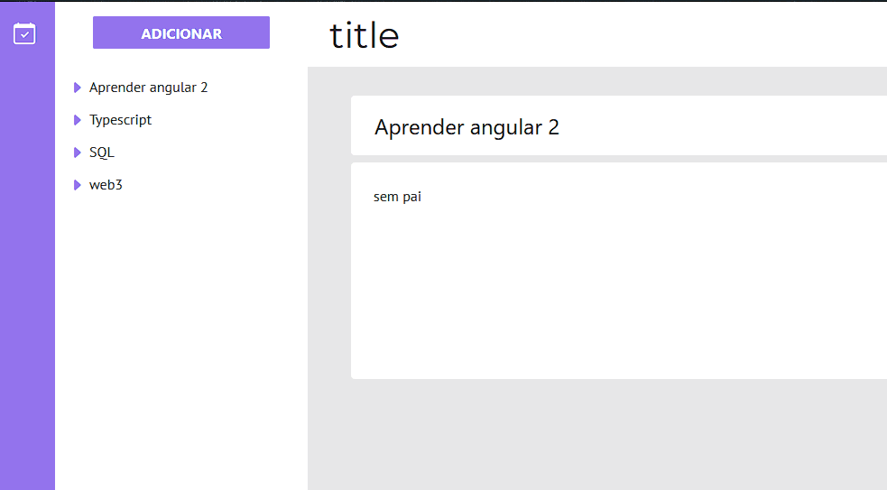
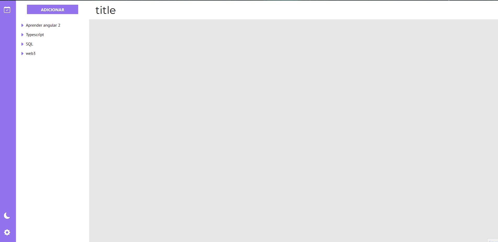

# Arbol notes API

O Arbol é uma ferramenta para acompanhamento de tarefas onde o utilizador terá a experiência
de realizar um estudo mais inteligente, através da criação de tarefas que retornam
ao utilizador utilizando do mecanismo de repetição espaçada já explorado em outras
aplicações.

## Apresentação

### Arvore de tarefas

<div style="display: flex; justify-content: center; align-items: center">
  
</div>  

### Sistema de temas

<div style="display: flex; justify-content: center; align-items: center">
  
</div>  

## ✅ Como Usar

  ```
# Clone o repositório
$ git clone https://github.com/psbrunosouza/arbol-notes-angular.git

# Entre na pasta do repositório
$ cd arbol-notes-angular

# Instale as dependências
$ yarn install/ npm install

# Rode a aplicação
$ ng serve
  ```

## 🚀 Tecnologias
Esse projeto foi desenvolvido com:

- <a href="https://angular.io/">Angular</a>
- <a href="https://www.npmjs.com/package/ngx-markdown">ngx-markdown</a>
- <a href="https://getbootstrap.com/docs/5.0/getting-started/introduction/">Bootstrap 5</a>

## 📝 Licença
Este código-fonte está sob uma licensa MIT. Confira a licença para mais informações.

## #️⃣ Versão
- 0.3.2
